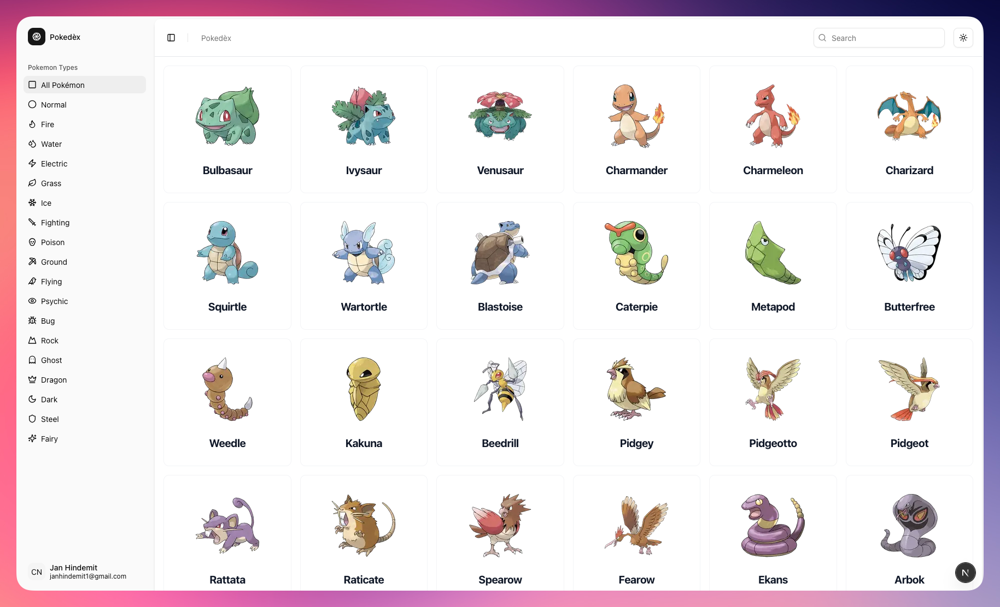

# 🔥 Pokédex - Next.js

Ein modernes, responsives Pokédex-Web-App gebaut mit Next.js und TypeScript. Entdecke alle Pokémon mit einer benutzerfreundlichen Oberfläche, fortgeschrittener Suche und eleganten Animationen.



## ✨ Features

- 🔍 **Erweiterte Suche**: Suche Pokémon nach Namen oder filtere nach Typen
- 📱 **Responsive Design**: Optimiert für Desktop, Tablet und Mobile
- 🌙 **Dark/Light Mode**: Umschaltbarer Themenmodus
- ⚡ **Infinite Scrolling**: Lade mehr Pokémon beim Scrollen
- 🎨 **Smooth Animations**: Elegant animierte Übergänge und Laden-States
- 📊 **Detaillierte Stats**: Vollständige Pokémon-Informationen mit Diagrammen
- 🎯 **Type-basierte Filterung**: Filtere Pokémon nach ihren Typen
- 🚀 **Performance**: Optimierte Datenladung mit Caching

## 🛠️ Tech Stack

### **Frontend Framework**

- **[Next.js 15](https://nextjs.org/)** - React Framework für Produktion
- **[React 18](https://reactjs.org/)** - UI Library
- **[TypeScript](https://www.typescriptlang.org/)** - Type Safety

### **Styling & UI**

- **[Tailwind CSS](https://tailwindcss.com/)** - Utility-first CSS Framework
- **[shadcn/ui](https://ui.shadcn.com/)** - Re-usable Components built with Radix UI and Tailwind CSS
- **[Lucide React](https://lucide.dev/)** - Beautiful & consistent Icon Library

### **Animations**

- **[Motion/React](https://motion.dev/)** - Lightweight Animation Library

### **State Management & Data Fetching**

- **[Zustand](https://github.com/pmndrs/zustand)** - Lightweight State Management
- **[SWR](https://swr.vercel.app/)** - Data Fetching mit Caching, Revalidation und Fehlerbehandlung

### **API & Daten**

- **[PokéAPI](https://pokeapi.co/)** - RESTful Pokémon API
- **[JSON](https://www.json.org/)** - Datenformat

### **Development Tools**

- **[ESLint](https://eslint.org/)** - Linting Tool
- **[PostCSS](https://postcss.org/)** - CSS Transformer
- **[Autoprefixer](https://github.com/postcss/autoprefixer)** - CSS Vendor Prefixing

## 🚀 Installation & Setup

### Voraussetzungen

- Node.js 18+
- npm oder yarn

### 1. Repository klonen

```bash
git clone <repository-url>
cd pokedex
```

### 2. Dependencies installieren

```bash
npm install
# oder
yarn install
```

### 3. Development Server starten

```bash
npm run dev
# oder
yarn dev
```

### 4. App öffnen

Öffne [http://localhost:3000](http://localhost:3000) in deinem Browser.

## 📁 Projekt Struktur

```
pokedex/
├── src/
│   ├── app/
│   │   ├── (routes)/                       # Route Grouping
│   │   │   ├── landing/                    # Landing Page
│   │   │   │   └── page.tsx
│   │   │   └── pokedex/                    # Pokédex Routes
│   │   │       ├── page.tsx               # Pokémon Liste
│   │   │       └── [name]/                 # Dynamic Route
│   │   │           └── page.tsx            # Pokémon Details
│   │   ├── globals.css                     # Global Styles
│   │   └── layout.tsx                      # Root Layout
│   ├── components/                         # UI Components
│   │   ├── ui/                            # shadcn/ui Components
│   │   ├── pokedex/                       # pokedex Components
│   │   └── Sidebar/                       # Navigation Components
│   ├── lib/                               # Utils & Services
│   │   ├── pokemon-type-icons.ts          # Type Icons & Colors
│   │   └── utils.ts                       # API Calls & Helpers
│   ├── store/                             # Zustand State
│   ├── types/                             # TypeScript Types
│   └── hooks/                             # Custom Hooks
├── public/                                # Static Assets
└── components.json                        # shadcn/ui Config
```

## 🎨 UI Komponenten

Das Projekt nutzt eine Kombination aus:

- **Custom Components** für Pokémon-spezifische UI
- **Shadcn/ui** Pattern für konsistente Komponenten
- **Tailwind CSS** für schnelles, responsives Styling

## 📊 Features im Detail

### 🔍 Such-Funktionalität

- Live-Suche nach Pokémon-Namen
- Typ-basierte Filterung

### 📱 Responsive Design

- Mobile-First Approach
- Adaptive Grid Layouts
- Touch-optimierte Navigation

### ⚡ Performance Optimierungen

- SWR für intelligentes Caching
- Image Optimization mit Next.js
- Lazy Loading für bessere Performance
- Infinite Scrolling für große Datenmengen

### 🎨 Animations & UX

- Smooth Page Transitions
- Loading States mit Skeleton UI
- Spring-basierte Animationen

## 🌐 API Integration

Das Projekt nutzt die **PokéAPI** (https://pokeapi.co/) für:

- Pokémon Basisdaten
- Detaillierte Statistiken
- Typ-Informationen
- Offizielle Artwork Images
